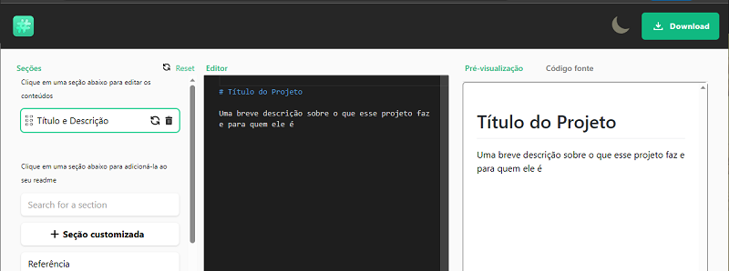
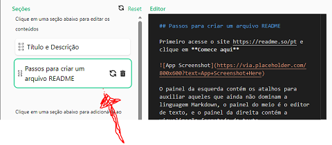

# Editando facilmente o README.md em seus projetos
Artigo escrito para a comunidade DIO (https://web.dio.me)

## Introdução

Todos sabemos que um README é um documento essencial de qualquer projeto de software, pois **além de fornecer informações importantes sobre o projeto**, pode documentar como os outros desenvolvedores podem facilmente acessar, entender, alterar ou colaborar com o projeto. 

O arquivo README.md deve estar sempre localizado na pasta raiz do repositório do projeto, e praticamente todas as plataformas de hospedagem de código dão suporte à linguagem [Markdown](https://en.wikipedia.org/wiki/Markdown), que é uma linguagem fácil de formatação de textos, e que permite que documentos possam ser armazenados como textos simples, porém possam ser visualizados formatados, permitindo assim que possam ser editados por qualquer editor de texto. Mas nem todos os editores de texto dão suporte a Markdown...

Aí entra o [Readme.so](https://readme.so), que é uma ferramenta online que permite criar arquivos READMEs profissionais de forma rápida e fácil, sem a necessidade de conhecimento técnico avançado em design ou codificação, nem precisa ter editores de texto específicos ou utilizar IDEs somente para formatação dos READMEs.

## Passos para criar um arquivo README

Comece acessando o site https://readme.so/pt e clique no botão **```Comece aqui```**.



O painel da esquerda contém as seções do seu documento e os atalhos para auxiliar aqueles que ainda não dominam a linguagem Markdown, o painel do meio é o editor de texto, e o painel da direita contém a visualização formatada do texto.

Você pode escrever o texto diretamente no editor incluindo as formatações, mas se você não domina o Markdown ou não lembra de todas as formatações, pode clicar nos atalhos para visualizar os exemplos e incluí-los no seu texto. Cada atalho selecionado é incluído no seu documento com o uma nova seção, você pode editá-lo à vontade e visualizar como ficará formatado no seu documento em tempo real. Cada sessão tem o seu próprio texto e serve unicamente para te ajudar a organizar o seu documento. Se quiser removê-la, basta clicar na lixeira e a seção será excluída do seu documento.

Clicando no botão **```+ Seção customizada```** é incluída uma nova seção em branco no seu documento com o título customizado. Foi o que eu fiz abaixo, e completei com este texto.



Ao finalizar a edição, clique no link **```Código fonte```** para copiar o texto e colar no arquivo README.md do repositório do seu projeto ou diretamente no repositório do GitHub.

## Conclusão

Certifique-se de revisar e atualizar o README conforme o seu projeto evolui e ganha novos recursos. Um README bem mantido é uma ferramenta poderosa para **manter os usuários e colaboradores informados sobre seu projeto**.

O [Readme.so](https://readme.so) é uma ferramenta que auxilia muito na composição do README de seu projeto ou que outro arquivo Mardown qualquer, permite que até aqueles que não dominam a linguagem possam formatar o documento e facilmente incluí-los em seus projetos.

Se este artigo te ajudou de alguma maneira, curta o artigo e interaja escrevendo seu comentário, crítica ou sugestão, afinal estamos em um ambiente colaborativo. 

Se quiser acessar meu [GitHub](https://github.com/gtnasser), lá compartilharei todos os artigos e projetos contendo códigos que acredito serem úteis para todos e a solução de alguns problemas que encontrei ao longo do tempo. E se o conteúdo do meu repo te ajudar de alguma maneira, me siga e marque com :star:

